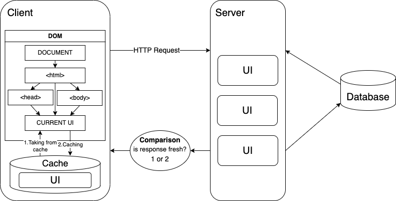

## Introduction

🌐 hmpl is a small template language for displaying UI from server to client. It is based on requests sent to the server via [fetch](https://developer.mozilla.org/en-US/docs/Web/API/Fetch_API) and processed into ready-made HTML. Reduce the size of your javascript files and display the same UI as if it was written in a modern framework.

### Example

### HTML before

```html
<div id="wrapper"></div>
<script src="https://unpkg.com/hmpl-js@2.1.3/dist/hmpl.min.js"></script>
<script>
  const templateFn = hmpl.compile(
    `<div>
       { 
         {
           "src":"http://localhost:8000/api/test" 
         } 
       }
    </div>`
  );

  const wrapper = document.getElementById("wrapper");

  const obj = templateFn();

  /**
   * obj = {
   *  response: div,
   *  status: 200
   * }
   */

  wrapper.appendChild(obj.response);
</script>
```

### API route - /api/test

```html
<span>123</span>
```

### HTML after

```html
<div id="wrapper">
  <div><span>123</span></div>
</div>
```

### About server-side rendering

Although the markup is generated on the server, the module <b>does not yet provide</b> functionality for displaying content to search robots.

### Discussion and development of an open-source project

This product has a discussion platform on [github](https://github.com/hmpl-js/hmpl/discussions). You can write your reviews or wishes about the project there. The project developer will try to answer you as soon as possible.

In the future, it is planned to maintain social networks, but for now the entire focus is only on the product.

## More examples

### Example 1

```javascript
import { compile } from "hmpl-js";

const templateFn = compile(
  `<div>
    <button class="getHTML">Get HTML!</button>
    { 
      {
        "src":"/api/test",
        "after":"click:.getHTML",
        "indicators": [
           {
             "trigger": "pending",
             "content": "<div>Loading...</div>"
           },
           {
             "trigger": "rejected",
             "content": "<div>Error</div>"
           }
        ]
      } 
    }
  </div>`
);

const wrapper = document.getElementById("wrapper");

const elementObj = templateFn({
  get: (prop, value) => {
    if (prop === "response") {
      if (value) {
        wrapper.appendChild(value);
      }
    }
  },
});
```

### Example 2

```javascript
import { compile, stringify } from "hmpl-js";

const request2 = stringify({
  src: "/api/test",
  initId: 2,
});

const templateFn = compile(
  `<div>
     { 
       {
         "src":"/api/test",
         "initId":"1"
       } 
     }
     {${request2}}
  </div>`
);

const wrapper = document.getElementById("wrapper");

const obj1 = templateFn([
  {
    id: "1",
    value: {
      credentials: "same-origin",
    },
  },
  {
    id: 2,
    value: {
      credentials: "omit",
    },
  },
]);

const obj2 = templateFn([
  {
    id: "1",
    value: {
      mode: "cors",
    },
  },
  {
    id: "2",
    value: {
      mode: "no-cors",
    },
  },
]);

wrapper.appendChild(obj1.response);
wrapper.appendChild(obj2.response);
```

### GitHub repository with examples

The [repository](https://github.com/hmpl-lang/examples) has a list of several example projects. There you can find examples with and without webpack, as well as a test local server.

## Installation

hmpl can be installed in several ways, which are described in this article. This tool is a simple javascript file that is connected in the usual way through a `script`, or using the `import` construct in an environment that supports this (webpack build, parcel build etc.). The first and easiest way is to install using a CDN.

### Package Manager

This method involves downloading through npm or other package managers.

```bash
npm i hmpl-js
```

> [Node.js](https://nodejs.org) is required for npm.

Along the path node-modules/hmpl/dist you can find two files that contain a regular js file and a minified one.

### Manual download

You can install the package by simply [downloading](https://unpkg.com/hmpl-js@2.1.3/dist/hmpl.min.js) it as a file and moving it to the project folder.

```html
<script src="./hmpl.min.js"></script>
```

If, for some reason, you do not need the minified file, then you can download the full file from this [link](https://unpkg.com/hmpl-js@2.1.3/dist/hmpl.js).

```html
<script src="./hmpl.js"></script>
```

The non-minified file is larger in size, but it is there as it is with all the formatting.

### CDN

This method involves connecting the file through a third-party resource, which provides the ability to obtain a javascript file from npm via a link.

```html
<script
  src="https://unpkg.com/hmpl-js@2.1.3/dist/hmpl.min.js"
  integrity="sha384-05LXn7xKeL/xlEh/bAHRwGVMn8r737zArv0K0rJssBAyCKDlQUvwDUPO14d3Khmf"
  crossorigin="anonymous"
></script>
```

This resource could be unpkg, skypack or other resources. The examples include unpkg simply because it is one of the most popular and its url by characters is not so long.

## Getting started

After installation using any convenient method described in [Installation](https://hmpl-lang.github.io/#/?id=installation), you can start working with the server in the following way:

```html
<script src="https://unpkg.com/hmpl-js@2.1.3/dist/hmpl.min.js"></script>
<script>
  const templateFn = compile(
    `{ 
       {
         "src":"/api/test" 
       } 
     }`
  );
  const elementObj = templateFn();
</script>
```

Or, if you need to work with hmpl as a module, there is a list of imported functions, such as `compile`:

```javascript
import { compile } from "hmpl-js";

const templateFn = compile(
  `{ 
     {
       "src":"/api/test" 
     } 
   }`
);

const elementObj = templateFn();
```

These will be the two main ways to interact with the server. In future versions, the functionality will be expanded, but the methods themselves will not change.

## Webpack

Module has its own loader for files with the `.hmpl` extension. You can include [hmpl-loader](https://www.npmjs.com/package/hmpl-loader) and use the template language syntax in separate files:

### main.hmpl

```hmpl
<div>
  {
    {
      "src":"/api/test"
    }
  }
</div>
```

### main.js

```javascript
const templateFn = require("./main.hmpl");

const elementObj = templateFn();
```

For the loader to work, it is better to use versions `0.0.2` or higher.

## hmpl

The main object of the entire module. It includes all the properties and methods that help you work with the server.

This object does not need to be imported. It is assigned to the entire document, so you can immediately use it in your code.

### compile

The `compile` function takes as its first argument a string that represents the extended HTML syntax with the request objects passed to it (more simply, the hmpl syntax), and as its second argument it takes the [HMPLCompileOptions](#HMPLCompileOptions) options object.

```javascript
const templateFn = hmpl.compile(
  `{ 
     {
       "src":"/api/test" 
     } 
   }`,
  {
    memo: true,
  }
);
```

#### Options

Sets options for all request objects coming from the [HMPLTemplateFunction](#HMPLTemplateFunction) generated by the current `compile` function.

##### memo

Specifies memoization for all request objects that match the condition described in the request [memo](#memo-1).

```javascript
{
  memo: true,
}
```

By default, the value is `false`.

#### RequestInit

`compile` returns a [template function](#HMPLTemplateFunction) that takes as arguments an object of type [HMPLRequestInit](#HMPLRequestInit), which initializes a dictionary with request options, or an array of objects of type [HMPLIdentificationRequestInit](#HMPLIdentificationRequestInit), which is essentially the same dictionary, but with an `id` for binding to specific requests.

```javascript
const elementObj = templateFn({
  method: "POST",
  mode: "cors",
  cache: "no-cache",
  credentials: "same-origin",
  headers: {
    "Content-Type": "text/html",
  },
  redirect: "follow",
  get: (prop, value) => {},
  referrerPolicy: "no-referrer",
  body: JSON.stringify(data),
  signal: new AbortController().signal,
  integrity: "...",
  window: null,
  refferer: "about:client",
});
```

or

```javascript
const elementObj = templateFn([
  {
    id: "1",
    value: {
      method: "POST",
      mode: "cors",
      cache: "no-cache",
      credentials: "same-origin",
      headers: {
        "Content-Type": "text/html",
      },
      redirect: "follow",
      get: (prop, value) => {},
      referrerPolicy: "no-referrer",
      body: JSON.stringify(data),
    },
  },
]);
```

> It is worth considering that if an array is passed, then if the `initId` property is not specified, the request will be sent without a options object

The `id` value of each options identification object is unique. The property value is a `string` or a `number`.

The function returns an object that depends on the template string to determine the number of properties. If there are 2 or more request objects in the template string, then the `requests` property is added, which has the value of an array of objects for each request object. Their properties are copied as if there was one request object in the template string.

```javascript
const templateFn = hmpl.compile(
  `{ 
     {
       "src":"/api/test" 
     } 
   }`
);
const elementObj = templateFn();
```

result:

```javascript
{
  status: 200,
  response: template
}
```

or

```javascript
const templateFn = hmpl.compile(
  `<div>
   {
     {
       "src":"/api/test"
     }
   }
   {
     {
       "src":"/api/test"
     }
   }
</div>`
);
const elementObj = templateFn();
```

result:

```javascript
{
  response: div,
  requests: [
    {
      status: 200,
      response: template,
    },
    {
      status: 200,
      response: template,
    },
  ],
};
```

The `response` that is generated for the `element` will not contain a `template` tag, but an array with `ChildNode`'s, because these nodes have already been rendered into the DOM from the template string.

Values are dynamically assigned to the object depending on the server response.

> The status changes depending on the server response. But, the most important thing is that it is not assigned several times if it is the same. When working with `Proxy` or `Object.defineProperty` or `get` or something like that, this will not give the object unnecessary updates!

##### get

The get property takes the value of a function that fires every time one of the properties is updated.

```javascript
const elementObj = templateFn({
  get: (prop, value, requestObject) => {
    switch (prop) {
      case "response":
        if (!requestObject) console.log(requestObject);
        console.log("Response:");
        console.log(value);
        break;
      case "status":
        console.log("Status:");
        console.log(value);
        break;
    }
  },
});
```

It is worth noting that the `requests` property is not called when the value changes, because the function is called when the values ​​in this property change only for array elements. This is a debatable thing, but it may not be necessary to call this function when a specific property of an object is called.

### stringify

This function accepts an object of type [HMPLRequestInfo](#HMPLRequestInfo) with request data and returns a string request object.

```javascript
const request = hmpl.stringify({
  src: "/api/test",
});
const templateFn = hmpl.compile(`{${request}}`);
```

It is based on `JSON.stringify`.

## Request

The main thing in hmpl syntax is string interpolation. In most frameworks, such as Cample and others, string interpolation occurs using double curly braces, but since it is not convenient to do three curly braces together with a request object, a single brace was chosen. The format in which string interpolation works is as follows - `{${request}}`.

> When working with request, all `script` tags are removed by the module.

The main way to send a request to the server is through a request object. This object includes the properties described below in documentation.

```hmpl
{
  {
     "src":"/api/test"
  }
}
```

This object is parsed using `JSON.parse`, so for convenience you can use the `stringify` function by passing the object that needs to be inserted into the string:

```javascript
const request = stringify({
  src: "/api/test",
});

const templateFn = compile(`{${request}}`);
```

This object is replaced with HTML that comes from the server using the `template` tag.

Until the request is sent, there will be a comment in place of the request object that looks like this:

```html
<!--hmpl1-->
```

This comment is replaced with HTML that comes from the server.

### src

This property specifies the url to which the request will be sent. Property `src` is required.

```hmpl
{
  {
     "src":"http://localhost:5000/api/test"
  }
}
```

It is worth considering that if there is no hostname (protocol etc.) in the url, the hostname (protocol etc.) of the address from which the request is sent will be substituted.

```hmpl
{
  {
     "src":"/api/test"
  }
}
```

### method

This property specifies the request method that is sent to the server. The default value is the `get` method.

```hmpl
{
  {
     "method":"get"
  }
}
```

The supported methods are `GET`, `POST`, `PUT`, `PATCH` or `DELETE`.

### after

The `after` property specifies after which event the request will be sent to the server. The value of the property is the string of the following construction `${event}:${selectors}`, where event is the event after which the request will be sent. and selectors are the targets to which event handlers will be assigned

```hmpl
{
  {
     "after":"click:.target"
  }
}
```

> Selectors are not looked for in the `document`, but in the template string.

The HTML that comes from the server will change to a new one each time in the DOM if events are triggered.

### indicators

The indicators property is intended to determine what HTML should be shown for a particular request status. The HTML markup in indicators is not extended by the module (it is not hmpl). The value is an object or an array of objects of type [HMPLIndicator](#HMPLIndicator).

```hmpl
{
  {
    "indicators": [
       {
         "trigger": "pending",
         "content": "<p>Loading...</p>"
       },
       {
         "trigger": "rejected",
         "content": "<p>Error</p><button>reload</button>"
       }
    ]
  }
}
```

The value of the `content` property is a string containing HTML markup.

The `trigger` values ​​are [http codes](https://developer.mozilla.org/en-US/docs/Web/HTTP/Status) without success (because they come from html), as well as values ​​based on the `rejected` and `pending` [Promise](https://developer.mozilla.org/en-US/docs/Web/JavaScript/Reference/Global_Objects/Promise) states, and a generic `error` value for all errors.

To avoid writing an indicator for each error, the `error` value is triggered by `rejected` errors and error codes (from 400 to 599).

The values ​​of the http codes that indicate errors (from 400 to 599), as well as the value `rejected`, overlap the value `error`.

### repeat

The `repeat` property receives a boolean value. If `true`, the request will be sent every time the event is processed on the `selectors` from the `after` property, and if `false`, the request will be sent only once, and after that all event listeners will be removed.

```hmpl
{
  {
     repeat:false
  }
}
```

By default, the value is `true`.

### memo

Enables request memoization. Allows you to optimize the application without re-rendering the DOM again. This process can be compared to `no-cache` for [`RequestСache`](https://developer.mozilla.org/en-US/docs/Web/API/Request/cache#value).

```hmpl
{
  {
     memo:true
  }
}
```

By default, the value is `false`.

The memoization process itself looks like this:



Also, response memoization only works with [repeat](#repeat) enabled.

### initId

The `initId` property references the `id` of the [HMPLRequestInit](#HMPLRequestInit) dictionary and determines what initialization the request will have. The value accepts both a `number` and a `string`.

```hmpl
<div>
  {
    {
      "src":"/api/test",
      "initId":"1"
    }
  }
  {
    {
      "src":"/api/test",
      "initId":2
    }
  }
</div>
```

```javascript
const arr = [
  { id: "1", value: {...} },
  { id: 2, value: {...} },
];
```

One dictionary can be referenced by several requests at once. This can be compared to the implementation of keys in databases

## Types

### HMPLRequestInit

A set of parameters that apply to fetch. Based almost entirely on [RequestInit](https://developer.mozilla.org/en-US/docs/Web/API/RequestInit).

```typescript
interface HMPLRequestOptions {
  mode?: RequestMode;
  cache?: RequestCache;
  redirect?: RequestRedirect;
  referrerPolicy?: ReferrerPolicy;
  integrity?: string;
  referrer?: string;
  get?: HMPLRequestGet;
  body?: BodyInit | null;
  signal?: AbortSignal | null;
  window?: any;
  credentials?: RequestCredentials;
  headers?: HMPLHeadersInit;
  timeout?: number;
}
```

### HMPLInstance

Return object of template function

```typescript
interface HMPLInstance {
  response: undefined | Element | null;
  status?: HMPLRequestStatus;
  requests?: HMPLRequest[];
}
```

### HMPLRequest

Object in the `requests` property

```typescript
interface HMPLRequest {
  response: undefined | Element | null | ChildNode[];
  status: number;
  id?: string;
}
```

### HMPLRequestGet

`get` function in options object

```typescript
type HMPLRequestGet = (prop: string, value: any, request?: HMPLRequest) => void;
```

### HMPLRequestInfo

An object that defines the properties of a request.

```typescript
interface HMPLRequestInfo {
  src: string;
  method: string;
  initId?: string | number;
  after?: string;
  repeat?: boolean;
  memo?: boolean;
  indicators?: HMPLIndicator[];
}
```

### HMPLCompile

Creates a template function

```typescript
type HMPLCompile = (
  template: string,
  options?: HMPLCompileOptions
) => HMPLTemplateFunction;
```

### HMPLCompileOptions

Sets options for the `compile` function.

```typescript
interface HMPLCompileOptions {
  memo?: boolean;
}
```

### HMPLTemplateFunction

The function returned in response to the `compile` function. Creates template instances.

```typescript
type HMPLTemplateFunction = (
  options?: HMPLIdentificationRequestInit[] | HMPLRequestInit
) => HMPLInstance;
```

### HMPLInitalStatus

Statuses based on the [Promise](https://developer.mozilla.org/en-US/docs/Web/JavaScript/Reference/Global_Objects/Promise) state, as well as those based on http codes without success.

```typescript
type HMPLInitalStatus =
  | "pending"
  | "rejected"
  | 100
  | 101
  | 102
  | 103
  | 300
  | 301
  | 302
  | 303
  | 304
  | 305
  | 306
  | 307
  | 308
  | 400
  | 401
  | 402
  | 403
  | 404
  | 405
  | 406
  | 407
  | 408
  | 409
  | 410
  | 411
  | 412
  | 413
  | 414
  | 415
  | 416
  | 417
  | 418
  | 421
  | 422
  | 423
  | 424
  | 425
  | 426
  | 428
  | 429
  | 431
  | 451
  | 500
  | 501
  | 502
  | 503
  | 504
  | 505
  | 506
  | 507
  | 508
  | 510
  | 511;
```

### HMPLIndicatorTrigger

Sets which trigger the indicator will be shown on

```typescript
type HMPLIndicatorTrigger = HMPLInitalStatus | "error";
```

### HMPLRequestStatus

Type for the full list of http codes, as well as for [Promise](https://developer.mozilla.org/en-US/docs/Web/JavaScript/Reference/Global_Objects/Promise) states without `fulfilled`. Used in the [HMPLRequest](#HMPLRequest) object to indicate the status of the request.

```typescript
type HMPLRequestStatus =
  | HMPLInitalStatus
  | 200
  | 201
  | 202
  | 203
  | 204
  | 205
  | 206
  | 207
  | 208
  | 226;
```

### HMPLIndicator

Inrerface for indicator object

```typescript
interface HMPLIndicator {
  trigger: HMPLIndicatorTrigger;
  content: string;
}
```

### HMPLHeadersInit

headers object in options object

```typescript
interface HMPLHeadersInit {
  [key: string]: string;
}
```

### HMPLIdentificationRequestInit

Initializes a reference to a specific [HMPLRequestInit](#HMPLRequestInit) dictionary using `id`.

```typescript
interface HMPLIdentificationRequestInit {
  value: HMPLRequestInit;
  id: string | number;
}
```

## Changelog

[Changelog](/changelog)
